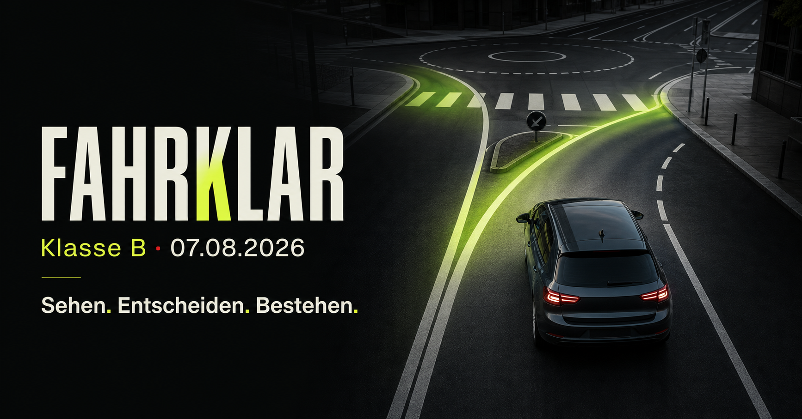

# Fahrklar — Klasse B

[](https://github.com/kanuwrld/fahrklar-klasse-b/actions/workflows/ci.yml)
[](https://fahrklar-klasse-b.vercel.app)

[Открыть сайт](https://fahrklar-klasse-b.vercel.app) ·
[English](README.md) ·
[Deutsch](README.de.md) ·
[Управление проектом](PROJECT_MANAGEMENT.md) ·
[Архитектура](docs/architecture.md) ·
[Безопасность](SECURITY.md)



Интерактивный мобильный тренажёр для подготовки к практической
`Fahrprüfung Klasse B` в Германии. Немецкие экзаменационные формулировки
дополнены понятными русскими объяснениями.

## Что внутри

- 20 дорожных ситуаций формата «выбери безопасный вариант»;
- 40 оптимизированных WebP-изображений;
- 36 технических вопросов по машине;
- команды `Prüfer` с немецкой озвучкой;
- 5 манёвров `Grundfahraufgaben`;
- пробный экзамен из 12 заданий;
- отдельное повторение ошибок;
- сохранение прогресса только в браузере;
- адаптивный интерфейс для телефона и компьютера.

## Локальный запуск

Требование: Node.js `>=22.13.0`.

```bash
npm ci
npm run dev:vercel
```

Открой `http://localhost:3000`.

## Полная проверка

```bash
npm run check
```

Команда запускает lint, TypeScript, тесты, оба production-build и аудит
зависимостей.

## Безопасность

Проект не использует аккаунты, серверную базу, аналитику или рекламные
трекеры. Прогресс остаётся в `localStorage`. API-ключи и runtime-secrets не
требуются. Подробности: [SECURITY.md](SECURITY.md).

## Источники

- [Straßenverkehrs-Ordnung (StVO)](https://www.gesetze-im-internet.de/stvo_2013/)
- [FeV Anlage 7 — Fahrerlaubnisprüfung](https://www.gesetze-im-internet.de/fev_2010/anlage_7.html)
- [Bundesministerium für Verkehr](https://www.bmv.de/SharedDocs/DE/Artikel/StV/Strassenverkehr/fahrerlaubnispruefung.html)

## Важно

Ситуации и изображения — учебный материал, не официальный
`TÜV/DEKRA-Fragenkatalog` и не замена занятиям с `Fahrlehrer`. Проект не связан
с TÜV, DEKRA или ADAC.
